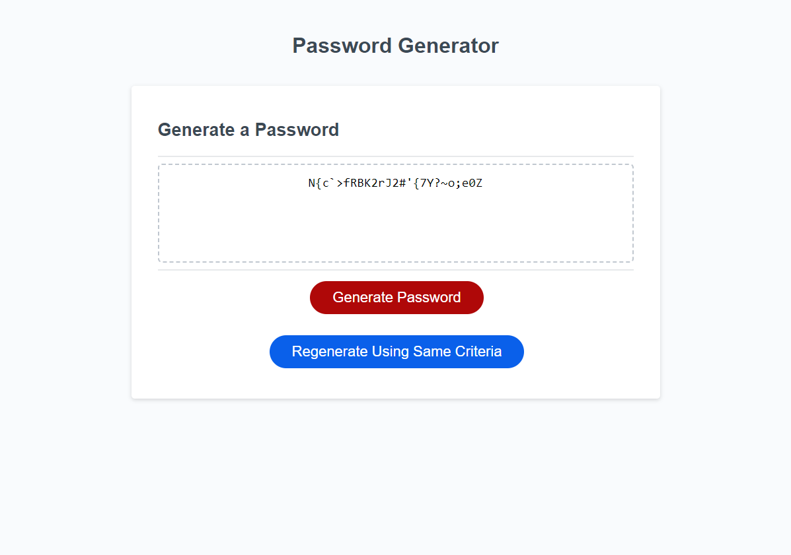

# Password-Generator

## Description

This is a simple password generator created using Javascript. After clicking the "Generate Password" button, the user will be prompted for the criteria that they want their password to contain. Users will also be given the option to click on a second button that allows them to generate a new password using the same selected criteria. Users can generate a new password with new criteria if they choose to.

## Instructions

Click on the red "Generate Password" button to be prompted with the criteria that you wish to select. After generating this password, a second, blue button will appear titled "Regenerate Using Same Criteria." This will regenerate a new password with the preferences that you picked.

## Usage

This is to be used by users who want to generate a secure password for personal use. It is not reccomended to use this for professional use.

## Link
https://cmeesh11.github.io/password-generator/

## Image of webpage:

